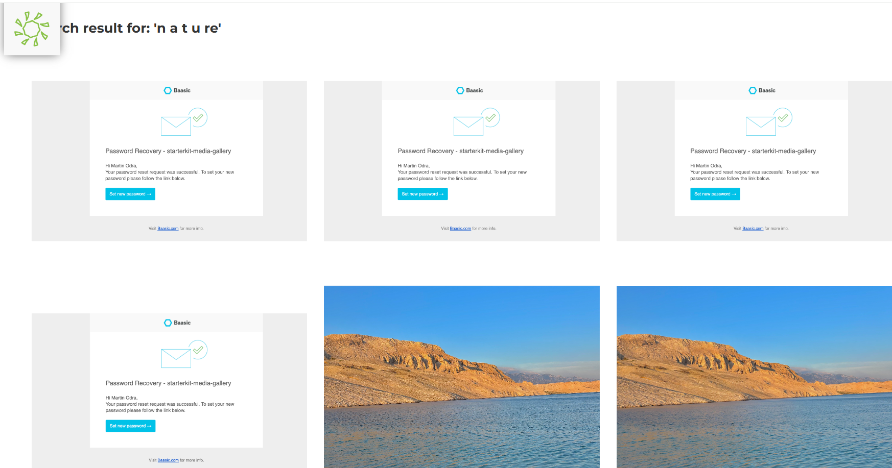
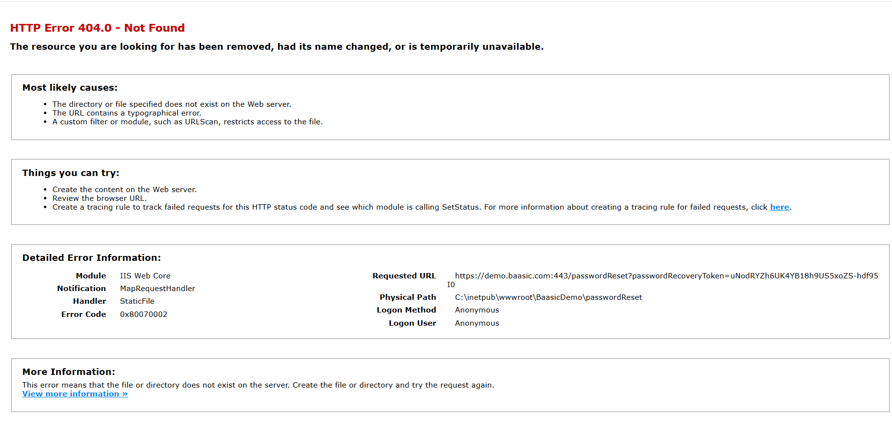
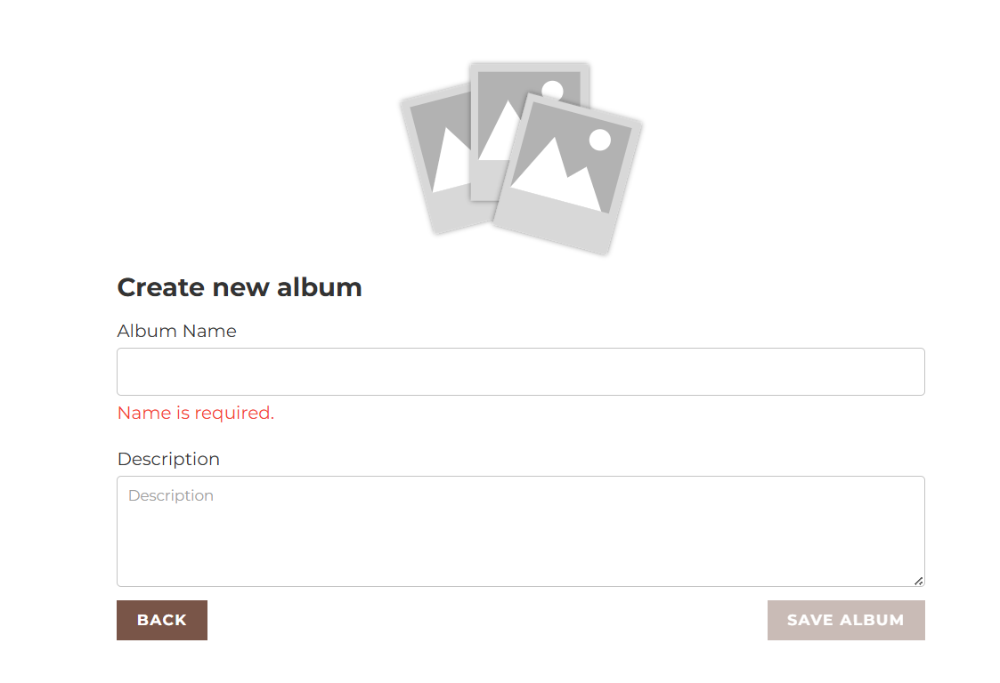
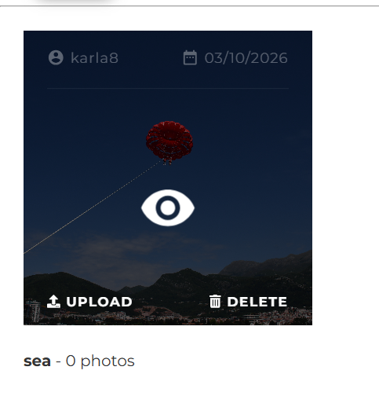
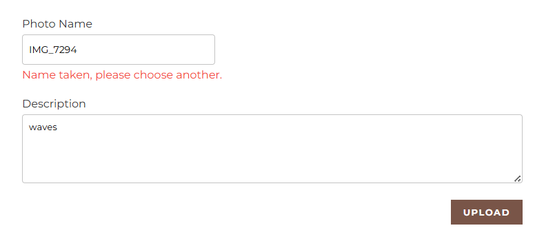
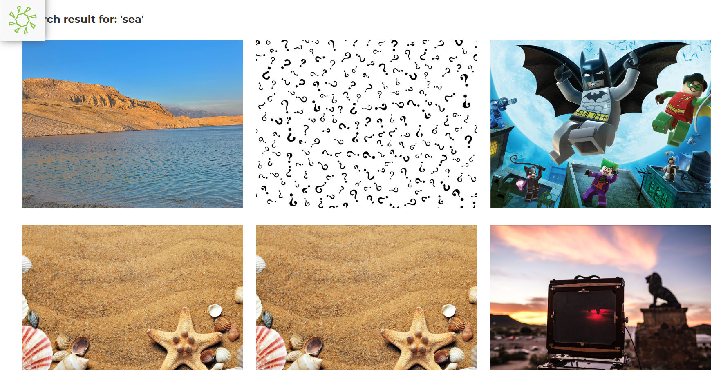
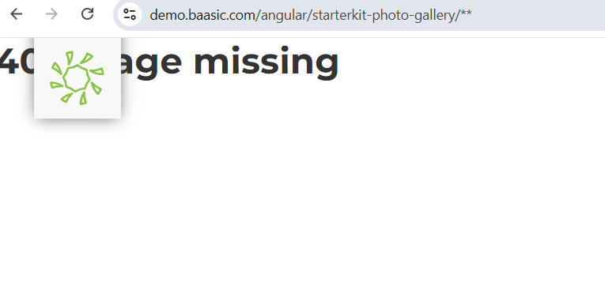
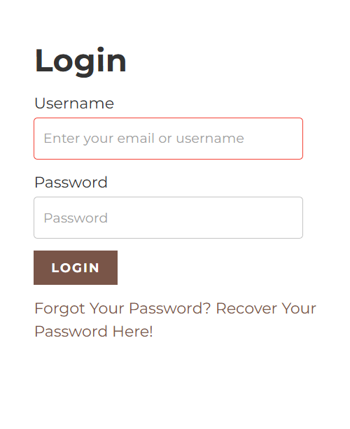
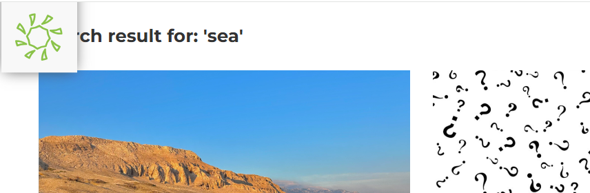

# [BUG-001] Dynamic content loading failure and scroll lock
**Description:** The application fails to load the full content. It intermittently loads only 1-3 rows before locking the scroll. Furthermore, clicking the scroll icon again results in a complete failure to load any further content.

**Severity:** Critical
**Priority:** High

**Steps to Reproduce:**

1. Navigate to the homepage.

2. Attempt to scroll down to view the gallery/album section.

3. Observe the loading behavior (note that it loads only 1-3 rows).

4. Try to scroll further to reach the bottom of the page.

5. Click the scroll icon to attempt further loading.

6. Observe the failure on the subsequent attempt (no content loads at all).

*Expected Behavior:* The application should load all available content seamlessly as the user scrolls. The user must be able to scroll to the very footer of the page.

*Actual Behavior:* The scrolling locks prematurely after 1-3 rows of content. Subsequent attempts to trigger loading via the scroll icon result in zero content loading.

**Attachment:** 

# [BUG-002] Broken image
**Description:** The application fails to load the actual image for the photo entry. Instead of the expected visual content, it displays a generic empty container with the text "Photo test".

**Severity:** Major
**Priority:** High

**Steps to Reproduce:**

1. Navigate to the gallery section.

2. Click on the "Photo test" item to open the detailed view.

3. Observe the area where the image should be displayed.

*Expected Behavior:* The actual uploaded image should be rendered clearly in the container.

*Actual Behavior:* An empty white container is displayed with "Photo test" text inside, and the image content is missing.

**Attachment:** 

# [BUG-003] Search functionality fails to handle spaces in query
**Description:** The search feature in the media gallery fails to correctly parse search terms containing spaces Instead of filtering for relevant images, the system treats the input as an empty or invalid query, defaulting to returning all available images in the database.

**Severity:** Medium
**Priority:** High

**Steps to Reproduce:**

1. Navigate to the Gallery search bar.

2. Enter a search term with spaces between letters (e.g., 'n a t u r e').

3. Observe the search results.

*Expected Behavior:*
The system should either trim the spaces to search for "nature" or display a "No results found" message if the exact string (with spaces) does not match any image metadata. It should definitely not return the entire database.

*Actual Behavior:*
The search logic fails to handle the whitespace, causing a fallback that displays every single image ever uploaded to the gallery.

**Attachment:** 

# [BUG-004] Global failure in image rendering and gallery interaction
**Description:** There is a critical failure in the application's gallery and album functionality.

*Broken Assets:* Album covers and images do not render. The application displays empty white placeholders instead of the uploaded content.

*Broken Interaction:* Clicking on the elements that do manage to load (partially) causes the entire content container to disappear, rendering the gallery inaccessible.

*Rendering Inconsistency:* The application fails to retrieve or display image assets across multiple albums ("testCover0", "photoUploadTest").

**Severity:** Critical
**Priority:** High

**Steps to Reproduce:**

1. Navigate to any album or photo gallery.

2. Observe the image containers — they appear as empty white boxes ("Album cover test").

3. Attempt to click on any visible image.

4. Observe that the entire content area vanishes upon interaction.

*Expected Behavior:* All images should load properly, and clicking them should navigate the user to the full-size view or album details without the UI breaking.

*Actual Behavior:* Image assets fail to render (broken placeholders). Interaction with the elements triggers a UI collapse, making the gallery impossible to browse.

**Attachment:**  

# [TC-001] Email format validation
**Description:** Verify that the registration form rejects invalid email formats and displays an error message.

**Status:** Passed

**Steps to Reproduce:**

1. Navigate to the Registration page.

2. In the Email field, enter "test" (an incorrect format).

3. Attempt to proceed or click out of the field.

**Expected Behavior:** The system should detect that the input is not a valid email address and display an error message: "Please enter the correct email address!"

**Actual Behavior:** The system correctly identifies the invalid format and displays the expected error message.

**Attachment:**  

# [TC-002] Password complexity and confirmation validation
**Description:** Verify that the registration form enforces minimum password length and requires the "Confirm Password" field to be filled.

**Status:** Passed

**Steps to Reproduce:**

1. Navigate to the Registration page.

2. In the "Password" field, enter a short sequence (e.g., "test").

3. Leave the "Confirm Password" field empty.

4. Observe the validation messages.

*Expected Behavior:* The system should display error messages indicating that the password is too short and that the confirmation field is required.

*Actual Behavior:* The system correctly displays: "Confirm Password is required." and "Password too short."

**Attachment:**  

# [BUG-005] Lack of input validation for Username and Password fields
**Description:** The registration form lacks input validation for character length and allowed symbols in the "Username" and "Password" fields. The system accepts excessively long inputs (including special characters, symbols, and non-standard encoding like Ž, Ć, Š) without truncation or error handling.

**Severity:** Major
**Priority:** High

**Steps to Reproduce:**

1. Navigate to the Registration page.

2. In the "Username" field, enter a very long string containing mixed symbols, special characters, and non-ASCII characters (e.g., "AdcrtEDŽćšča.,,lčč%6"#443456,.!$&&I()(U[]ghr4r").

3. In the "Password" and "Confirm Password" fields, enter a similarly long string.

4. Click "Register".

*Expected Behavior:* The application should enforce a reasonable character limit (e.g., 50 characters for username, 128 for password) and restrict characters if necessary to prevent injection attacks.

*Actual Behavior:* The app accepts the input without any warning or restriction. 

**Attachment:**  

# [TC-003] Duplicate user registration prevention
**Description:** Verify that the app prevents multiple registrations with the same email address or username.

**Status:** Passed

**Steps to Reproduce:**

1. Attempt to register a new account with an email address or username that is already present in the database.

2. Click the "Register" button.

*Expected Behavior:* The application should display an error message notifying the user that the username or email is already taken.

*Actual Behavior:* The system correctly validates the uniqueness of the credentials and informs the user that the registration cannot be completed due to duplicates.

# [BUG-006] Non-functional 'Add Image' trigger 
**Description:** The Registration page features a brown "+" icon overlaying the profile placeholder. This UI element implies a functional "Upload Image" or "Change Profile Picture" feature. However, clicking this icon produces no action, nor does it open a file picker or provide any feedback.

**Severity:** Minor (UI/UX issue)
**Priority:** Low

**Steps to Reproduce:**

1. Navigate to the Registration page.

2. Locate the profile picture area with the brown "+" icon.

3. Attempt to click the icon.

4. Observe the lack of any system response.

*Expected Behavior:* The icon should trigger a file selection dialog allowing the user to upload a profile picture.

*Actual Behavior:* The icon remains completely unresponsive, creating confusion regarding its purpose and functionality.

**Attachment:**  

# [OBS-001] Account lockout mechanism verification
**Description:** The app correctly identifies and enforces account lockout status for the "test" username.

**Observation:** Upon attempting to log in with the username "test", the system returns the message "User is locked." 

**Steps to Verify:**

1. Navigate to the Login page.

2. Enter "test" as the username and any password.

3. Click "LOGIN".

4. Observe the system response.

**Result:** The system accurately reports the account status.

**Attachment:**  

# [BUG-007] Error display during password recovery
**Description**: The password recovery process functions correctly for valid users, but the system exhibits unstable error handling when an invalid email is entered. Occasionally, instead of a user-friendly error message, the system displays a technical string [object Object]. 
**Severity:** Medium
**Priority:** High

**Steps to Reproduce:**

1. Navigate to the Password Recovery page.

2. Enter an invalid or non-registered email address.

3. Click "RECOVER PASSWORD".

4. Repeat the action multiple times or under varying network conditions.

5. Observe the UI response.

*Expected Behavior:*
The system should consistently display a clear, human-readable error message for invalid inputs. 

*Actual Behavior:*
While the system correctly identifies invalid users, it inconsistently displays a technical error [object Object] instead of a localized string. This exposes internal error handling logic to the end-user.

**Attachment:**   

# [BUG-008] Password Recovery link leads to 404 Not Found error
**Description:** The password recovery workflow is non-functional because the link generated and sent to the user's email leads to an HTTP 404.0 - Not Found error.

**Severity:** Critical
**Priority:** High

**Steps to Reproduce:**

1. Navigate to the Password Recovery page.

2. Enter a valid, registered email address and click "RECOVER PASSWORD".

3. Open the received password recovery email.

4. Click on the recovery link provided in the email.

5. Observe the browser output.

*Expected Behavior:*
The link should navigate the user to a functional password reset page where they can securely enter and confirm a new password.

*Actual Behavior:*
The browser displays an HTTP 404.0 - Not Found error page. The requested URL points to a location that does not exist on the server (see "Detailed Error Information" in the screenshot).

**Attachments:** 

# [BUG-009] Social Login service integration failure
**Description:** The Social Login functionality is entirely broken. Upon attempting to use any of the provided providers (Facebook, Twitter, Google, GitHub), the application fails to initiate the authentication process and displays a configuration error.

**Severity:** Major
**Priority:** High

**Steps to Reproduce:**

1. Navigate to the Login page.

2. Under the "Social Login" section, click on any of the provided icons (F, Twitter, G, or GitHub).

3. Observe the error message displayed below the icons.

*Expected Behavior:* Clicking on a social provider should redirect the user to the respective third-party authentication page.

*Actual Behavior:* The system fails to trigger the authentication flow and returns an error: "undefined: Social login configuration not found."

**Attachment:**  

# [BUG-010] Search index inconsistency and asset loading failure
**Description:** The search functionality displays inconsistent results and fails to render image assets correctly.
**Severity:** Major
**Priority:** High

**Steps to Reproduce:**

1. Navigate to the search bar and enter a keyword (e.g.,"nature").

2. Observe the results page.

3. Check for broken thumbnail images.

4. Compare multiple results to identify duplicates (the same image displayed with different metadata).

*Expected Behavior:* The search should return unique, correctly indexed images with accurate metadata and all thumbnails should load properly.

*Actual Behavior:* Broken image placeholders appear, and the system displays duplicated images with mismatched descriptions.

**Attachment:**    

# [BUG-011] Redundant UI placeholder in 'Create Album' form
**Description:** The "Description" field in the "Create new album" form contains a redundant placeholder that repeats the field label. 

**Severity:** Low
**Priority:** Low

**Steps to Reproduce:**

1. Navigate to the "Create new album" page.

2. Observe the "Description" textarea.

3. Compare the visible label ("Description") with the placeholder text inside the textarea.

*Expected Behavior:*
The placeholder should either be removed to reduce clutter, or replaced with descriptive text that adds value.

*Actual Behavior:*
The placeholder text is identical to the label, creating a redundant visual element.

**Attachment:** 

# [BUG-012] Missing hover effect on 'View Album' icon
**Description:** The "View" (eye) icon on the album cover lacks a hover state, making it feel unresponsive compared to the "Upload" and "Delete" actions. 

**Severity:** Low
**Priority:** Low

**Steps to Reproduce:**

1. Navigate to the dashboard where the album covers are listed.

2. Observe the "View" (eye) icon.

3. Move the mouse cursor over the "View" icon.

4. Move the mouse cursor over the "Upload" and "Delete" icons for comparison.

*Expected Behavior:*
The "View" icon should provide visual feedback upon hovering, matching the interaction pattern of the "Upload" and "Delete" buttons.

*Actual Behavior:*
The "View" icon remains completely static when hovered over, providing no visual indication that it is a clickable element.

**Attachment:** 

# [BUG-013] Incorrect 'Name taken' validation for new photo upload
**Description:** The app incorrectly flags unique photo names as "taken" during the upload process. Even when user enters a unique name the app blocks the upload with the error message "Name taken, please choose another."

**Severity:** High
**Priority:** High

**Steps to Reproduce:**

1. Navigate to the upload section of an album.

2. Enter a unique photo name (e.g., a random string or timestamp like "my_new_photo_123").

3. Observe the validation message displayed under the "Photo Name" field.

4. Try to click "UPLOAD" to see if the validation persists.

*Expected Behavior:*
The system should perform a correct check against the database and allow the upload if the name is unique. The error message should only appear if the name is genuinely already in use.

*Actual Behavior:*
The system falsely identifies the photo name as a duplicate, preventing the user from completing the upload process.

**Attachments:** 

# [BUG-014] Intermittent failure to display uploaded photos in album
**Description:** After a successful photo upload, the image occasionally fails to appear in the album view, showing "0 photos" despite the upload confirmation.

**Severity:** High
**Priority:** High

**Steps to Reproduce:**

1. Navigate to an existing album.

2. Click "UPLOAD" and complete the process with a valid image.

3. Observe the album overview page after the upload finishes.

4. If the photo appears, repeat the process with a different photo. 

*Expected Behavior:*
The album overview should immediately reflect the updated photo count and display the uploaded image thumbnail upon successful completion of the upload request.

*Actual Behavior:*
The album sporadically shows "0 photos" and remains empty, even though the backend confirms the file was uploaded successfully. 

**Attachment:** 

# [BUG-015] Mobile incompatibility: Search and Gallery non-functional on iOS
**Description:** The gallery and search functionalities are entirely unresponsive on iOS mobile browsers. 

**Severity:** Critical
**Priority:** High

**Steps to Reproduce:**

1. Open the application in Safari an iOS device.

2. Attempt to tap the "Search" icon.

3. Attempt to interact with the media gallery.

4. Observe the lack of any response or navigation.

*Expected Behavior:*
The mobile interface should be fully responsive, allowing users to perform searches and view the gallery just as they would on a desktop browser.

*Actual Behavior:*
The UI elements on the mobile interface are static and non-interactive. The search function cannot be triggered, and the gallery does not respond to touch events.

**Attachment:** 

# [BUG-016] Irrelevant image retrieval
**Description:** The search functionality returns highly irrelevant results. When searching for a specific keyword (e.g., "sea"), the system returns unrelated images that neither match the keyword in the title nor in the description. 

**Severity:** Medium
**Priority:** High

**Steps to Reproduce:**

**Navigate to the Gallery search bar.**

1. Enter a specific keyword (e.g., "sea") that corresponds to only a few images.

2. Observe the search results.

*Expected Behavior:*
The system should return only images where the keyword exists in the metadata (title or description).

*Actual Behavior:*
The system returns a mix of relevant and completely irrelevant images, suggesting a failure in the search index or query filtering logic.

**Attachment:** 

# [BUG-017] Unable to open photo in fullscreen (404 error)
**Description:** The "fullscreen" view functionality is broken. When a user clicks on any photo within an album to enlarge it, the system redirects to a missing page, resulting in an HTTP 404 - Not Found error. 

**Severity:** Critical
**Priority:** High

**Steps to Reproduce:**

1. Navigate to an album.

2. Click on any photo thumbnail to view it in fullscreen.

3. Observe the result.

*Expected Behavior:*
The application should open an overlay or navigate to a dedicated page displaying the selected photo in high resolution, along with its metadata (name, description).

*Actual Behavior:*
The user is directed to a 404 - Page Missing error page.

**Attachment:** 

# [BUG-018] Login label does not reflect input flexibility
**Description:** The login form's label and placeholder explicitly state "Username", which implies that only a username is accepted for authentication. However, the system also supports authentication via email address.

**Severity:** Low
**Priority:** Medium

**Steps to Reproduce:**

1. Navigate to the Login page.

2. Observe the input field label "Username" and the placeholder "Enter your email or username".

3. Attempt to log in using a registered email address.

*Expected Behavior:*
The label and helper text should be consistent and transparent. Since the system supports both methods, the label should be updated to "Username or Email" to accurately reflect the functionality.

*Actual Behavior:*
The label "Username" suggests an exclusive requirement, which contradicts the actual backend capability of accepting both usernames and email addresses.

**Attachment:** 

# [BUG-019] Search results overlay navigation menu
**Description:** When search results are displayed, the result container overlaps with the top navigation menu (or search bar area).
**Severity:** Low
**Priority:** Low

**Steps to Reproduce:**

1. Navigate to the Gallery search bar.

2. Enter a search query to trigger the results display.

3. Observe how the top navigation/menu area interacts with the incoming search result cards.

*Expected Behavior:*
The search result container should have proper margins or padding so that it does not obscure any part of the header, navigation menu, or other static UI elements.

*Actual Behavior:*
Search results are rendered on top of or underneath the navigation menu, causing visual overlap and potential interaction conflicts.

**Attachment:** 

