# [BUG-001] Dynamic content loading failure and scroll lock
**Description:** The application fails to load the full content. It intermittently loads only 1-3 rows before locking the scroll. Furthermore, clicking the scroll icon again results in a complete failure to load any further content.

**Severity:** Critical
**Priority:** High

**Steps to Reproduce:**

1. Navigate to the homepage.

2. Attempt to scroll down to view the gallery/album section.

3. Observe the loading behavior (note that it loads only 1-3 rows).

4. Try to scroll further to reach the bottom of the page.

5. Click the scroll icon to attempt further loading.

6. Observe the failure on the subsequent attempt (no content loads at all).

*Expected Behavior:* The application should load all available content seamlessly as the user scrolls. The user must be able to scroll to the very footer of the page.

*Actual Behavior:* The scrolling locks prematurely after 1-3 rows of content. Subsequent attempts to trigger loading via the scroll icon result in zero content loading.

**Attachment:** 

# [BUG-002] Photo thumbnail fails to render (Broken Image)
**Description:** The application fails to load the actual image for the photo entry. Instead of the expected visual content, it displays a generic empty container with the text "Photo test". This indicates that the image source URL is either broken or the asset failed to load from the server.

**Severity:** Major
**Priority:** High

**Steps to Reproduce:**

1. Navigate to the gallery section.

2. Click on the "Photo test" item to open the detailed view.

3. Observe the area where the image should be displayed.

*Expected Behavior:* The actual uploaded image should be rendered clearly in the container.

*Actual Behavior:* An empty white container is displayed with "Photo test" text inside, and the image content is missing.

**Attachment:** 

# [BUG-003] Global failure in image rendering and gallery interaction
**Description:** There is a critical failure in the application's gallery and album functionality.

*Broken Assets:* Album covers and images do not render. The application displays empty white placeholders instead of the uploaded content.

*Broken Interaction:* Clicking on the elements that do manage to load (partially) causes the entire content container to disappear, rendering the gallery inaccessible.

*Rendering Inconsistency:* The application fails to retrieve or display image assets across multiple albums ("testCover0", "photoUploadTest").

**Severity:** Critical
**Priority:** High

**Steps to Reproduce:**

1. Navigate to any album or photo gallery.

2. Observe the image containers — they appear as empty white boxes ("Album cover test").

3. Attempt to click on any visible image.

4. Observe that the entire content area vanishes upon interaction.

*Expected Behavior:* All images should load properly, and clicking them should navigate the user to the full-size view or album details without the UI breaking.

*Actual Behavior:* Image assets fail to render (broken placeholders). Interaction with the elements triggers a UI collapse, making the gallery impossible to browse.

**Attachment:** 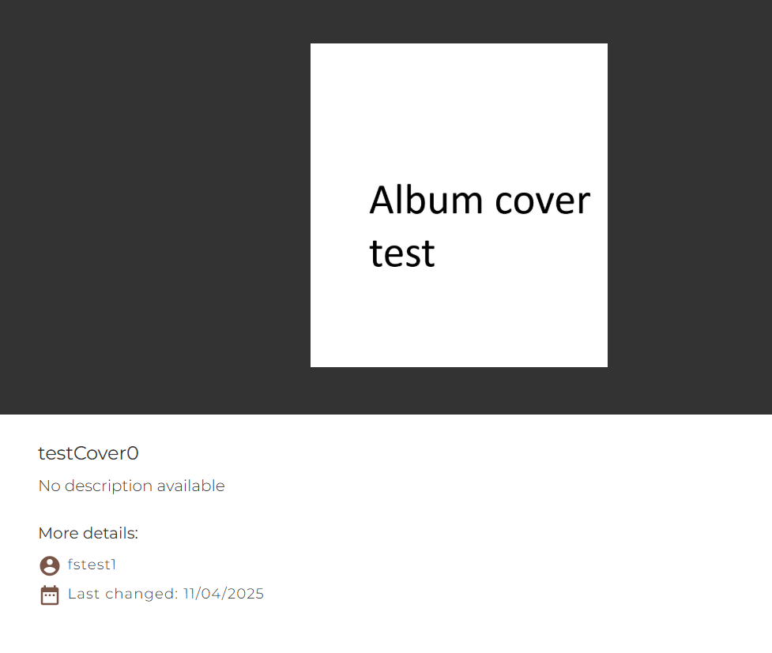 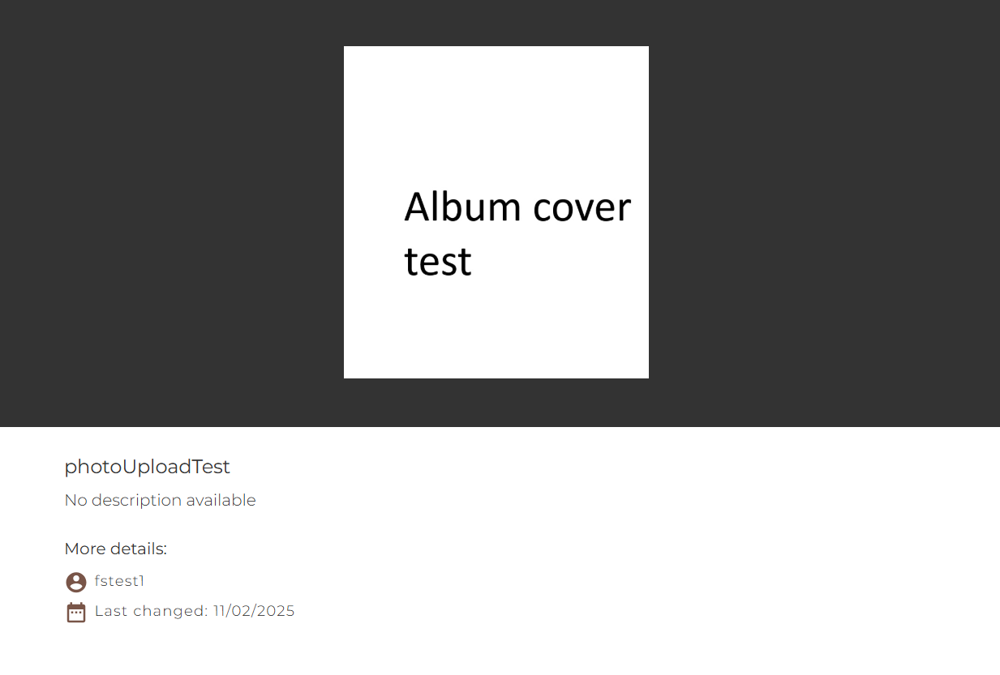

# [TC-001] Email format validation
**Description:** Verify that the registration form rejects invalid email formats and displays an error message.

**Status:** Passed

**Steps to Reproduce:**

1. Navigate to the Registration page.

2. In the Email field, enter "test" (an incorrect format).

3. Attempt to proceed or click out of the field.

**Expected Behavior:** The system should detect that the input is not a valid email address and display an error message: "Please enter the correct email address!"

**Actual Behavior:** The system correctly identifies the invalid format and displays the expected error message.

**Attachment:** 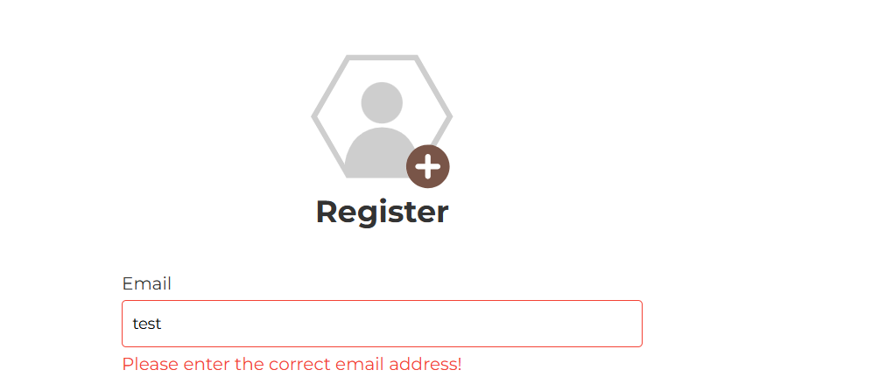 

# [TC-002] Password complexity and confirmation validation
**Description:** Verify that the registration form enforces minimum password length and requires the "Confirm Password" field to be filled.

**Status:** Passed

**Steps to Reproduce:**

1. Navigate to the Registration page.

2. In the "Password" field, enter a short sequence (e.g., "test").

3. Leave the "Confirm Password" field empty.

4. Observe the validation messages.

*Expected Behavior:* The system should display error messages indicating that the password is too short and that the confirmation field is required.

*Actual Behavior:* The system correctly displays: "Confirm Password is required." and "Password too short."

**Attachment:** 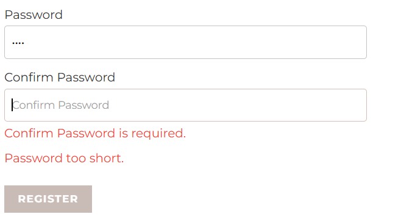 

# [BUG-004] Lack of input validation for Username and Password fields
**Description:** The registration form lacks input validation for character length and allowed symbols in the "Username" and "Password" fields. The system accepts excessively long inputs (including special characters, symbols, and non-standard encoding like Ž, Ć, Š) without truncation or error handling.

**Severity:** Major
**Priority:** High

**Steps to Reproduce:**

1. Navigate to the Registration page.

2. In the "Username" field, enter a very long string containing mixed symbols, special characters, and non-ASCII characters (e.g., "AdcrtEDŽćšča.,,lčč%6"#443456,.!$&&I()(U[]ghr4r").

3. In the "Password" and "Confirm Password" fields, enter a similarly long string.

4. Click "Register".

*Expected Behavior:* The application should enforce a reasonable character limit (e.g., 50 characters for username, 128 for password) and restrict characters if necessary to prevent injection attacks.

*Actual Behavior:* The system accepts the input without any warning or restriction. This exposes the database to potential security threats and UI layout breakage.

**Attachment:** 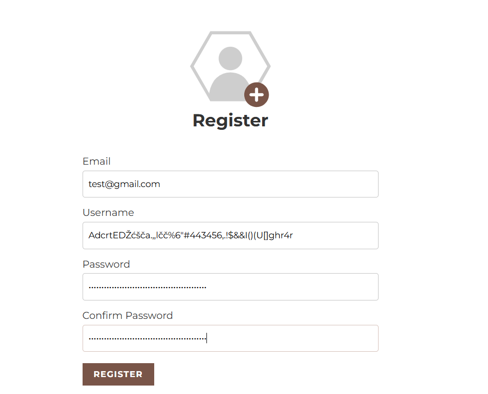 

# [TC-003] Duplicate user registration prevention
**Description:** Verify that the system prevents multiple registrations with the same email address or username.

**Status:** Passed

**Steps to Reproduce:**

1. Attempt to register a new account with an email address or username that is already present in the database.

2. Click the "Register" button.

*Expected Behavior:* The application should display an error message notifying the user that the username or email is already taken.

*Actual Behavior:* The system correctly validates the uniqueness of the credentials and informs the user that the registration cannot be completed due to duplicates.

# [BUG-005] Non-functional 'Add Image' trigger (UI Ambiguity)
**Description:** The Registration page features a brown "+" icon overlaying the profile placeholder. This UI element implies a functional "Upload Image" or "Change Profile Picture" feature. However, clicking this icon produces no action, nor does it open a file picker or provide any feedback.

**Severity:** Minor (UI/UX issue)
**Priority:** Low

**Steps to Reproduce:**

1. Navigate to the Registration page.

2. Locate the profile picture area with the brown "+" icon.

3. Attempt to click the icon.

4. Observe the lack of any system response.

*Expected Behavior:* The icon should trigger a file selection dialog allowing the user to upload a profile picture, or it should be removed if the feature is not yet implemented.

*Actual Behavior:* The icon remains completely unresponsive, creating confusion regarding its purpose and functionality.

**Attachment:** 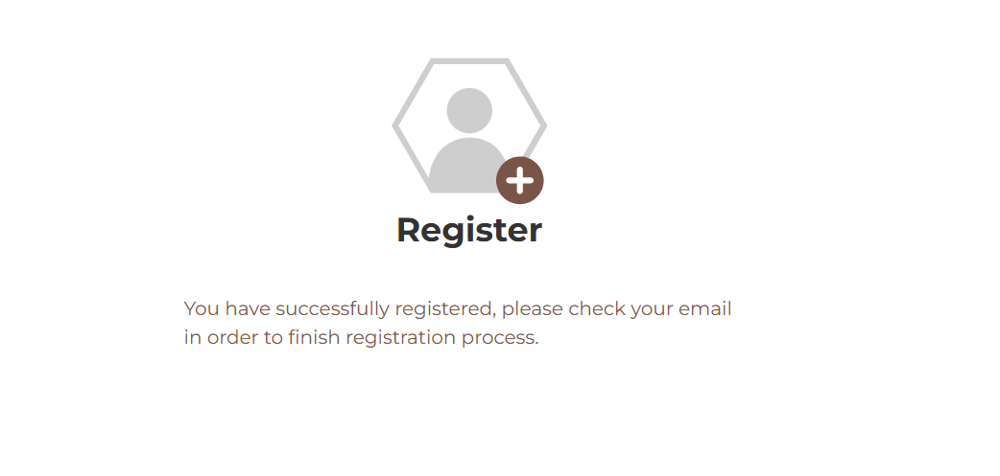 

# [BUG-006] Authentication failure and misleading error message
**Description:** Registered users are unable to log in with their correct credentials. Additionally, the system returns a misleading error message ("Invalid email, username or password") which implies that an email is required for login, even though the login interface only provides a "Username" field.

**Severity:** Critical
**Priority:** High

**Steps to Reproduce:**

1. Navigate to the Login page.

2. Enter the valid username and password of a previously registered account.

4. Click "LOGIN".

5. Observe the error message and the inability to access the account.

*Expected Behavior:* The system should authenticate the user and redirect them to their dashboard/home page. If an error occurs, the message should accurately reflect the input fields (e.g., "Invalid username or password").

*Actual Behavior:* Login fails despite using valid credentials. The error message is generic, confusing, and references an "email" field that does not exist in the login form.

**Attachment:** 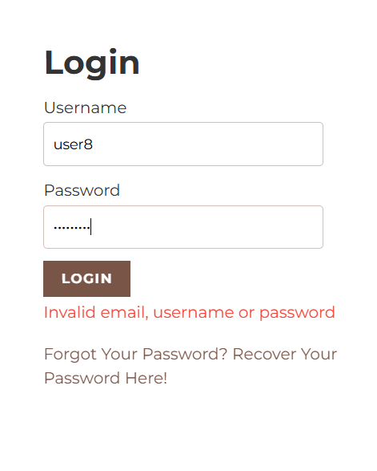 

# [OBS-001] Account lockout mechanism verification
**Description:** The application correctly identifies and enforces account lockout status for the "test" username.

**Observation:** Upon attempting to log in with the username "test", the system returns the message "User is locked." This confirms that the application has a functional account security/lockout mechanism in place.

**Steps to Verify:**

1. Navigate to the Login page.

2. Enter "test" as the username and any password.

3. Click "LOGIN".

4. Observe the system response.

**Result:** The system accurately reports the account status.

**Attachment:** 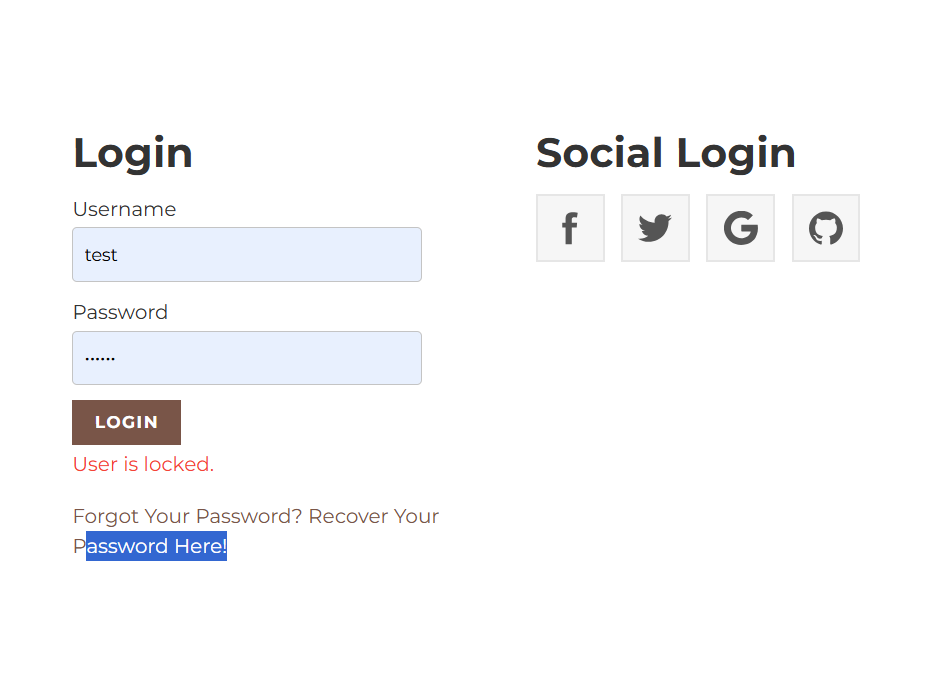 

# [BUG-007] Password recovery failure and incorrect error handling
**Description:** The password recovery process is broken. The system fails to recognize valid, registered email addresses, returning "Unknown user." Furthermore, the system exhibits poor error handling, occasionally displaying [object Object] instead of a human-readable error message.

**Severity:** Critical
**Priority:** High

**Steps to Reproduce:**

1. Navigate to the Password Recovery page.

2. Enter the email address of a successfully registered user.

3. Click "RECOVER PASSWORD".

4. Observe the error response (either "Unknown user" or [object Object]).

*Expected Behavior:* The system should identify the user and send a recovery email. If a failure occurs, it should display a clear, user-friendly error message.

*Actual Behavior:* The system fails to locate valid users ("Unknown user") and displays technical, non-human-readable errors ([object Object]).

**Attachment:** 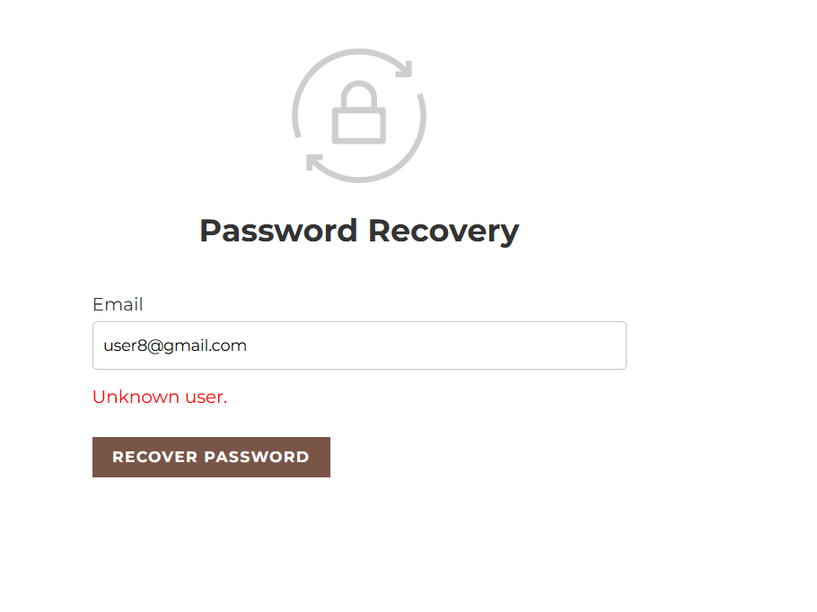 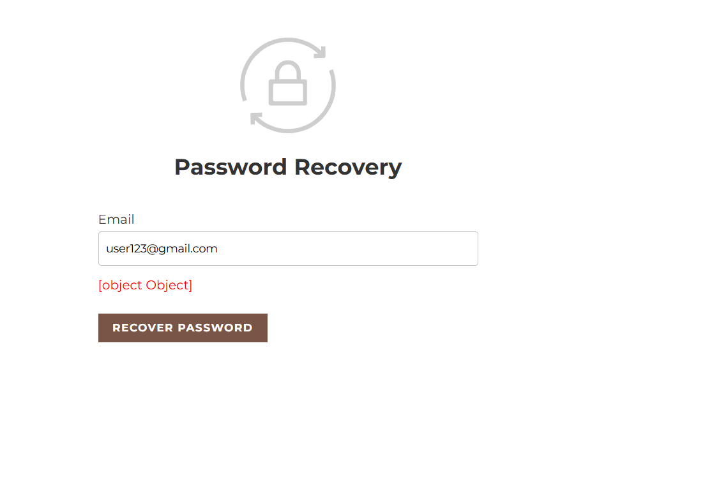 

# [BUG-008] Social Login service integration failure
**Description:** The Social Login functionality is entirely broken. Upon attempting to use any of the provided providers (Facebook, Twitter, Google, GitHub), the application fails to initiate the authentication process and displays a configuration error.

**Severity:** Major
**Priority:** High

**Steps to Reproduce:**

1. Navigate to the Login page.

2. Under the "Social Login" section, click on any of the provided icons (F, Twitter, G, or GitHub).

3. Observe the error message displayed below the icons.

*Expected Behavior:* Clicking on a social provider should redirect the user to the respective third-party authentication page (e.g., Google's login screen).

*Actual Behavior:* The system fails to trigger the authentication flow and returns an error: "undefined: Social login configuration not found."

Attachment: 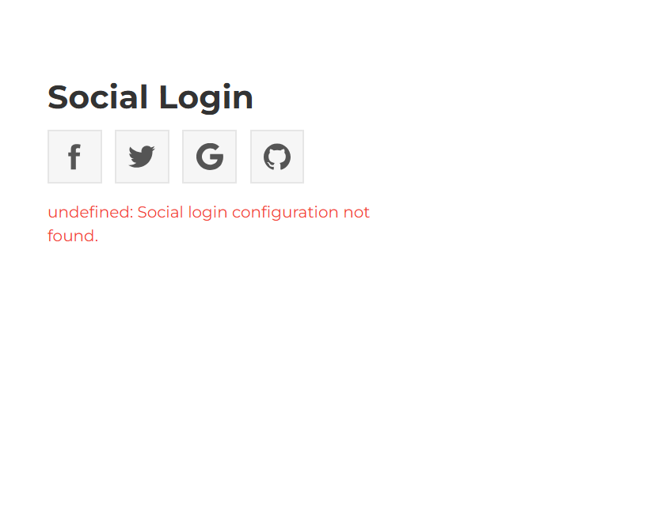 

# [BUG-009] Search index inconsistency and asset loading failure
**Description:** The search functionality displays inconsistent results and fails to render image assets correctly.

**Broken Assets:** Images in search results frequently fail to load, displaying a generic placeholder icon.

**Data Inconsistency:** The system returns duplicate image entries with differing titles/descriptions (e.g., the same "Nature" path image is indexed as both "sand beach" and "nature").

**Indexing Error:** This indicates that the search index is not properly linked to the unique image file IDs, leading to inaccurate and broken search results.

**Severity:** Major
**Priority:** High

**Steps to Reproduce:**

1. Navigate to the search bar and enter a keyword (e.g., "nature").

2. Observe the results page.

3. Check for broken thumbnail images.

4. Compare multiple results to identify duplicates (the same image displayed with different metadata).

*Expected Behavior:* The search should return unique, correctly indexed images with accurate metadata and all thumbnails should load properly.

*Actual Behavior:* Broken image placeholders appear, and the system displays duplicated images with mismatched descriptions.

**Attachment:**  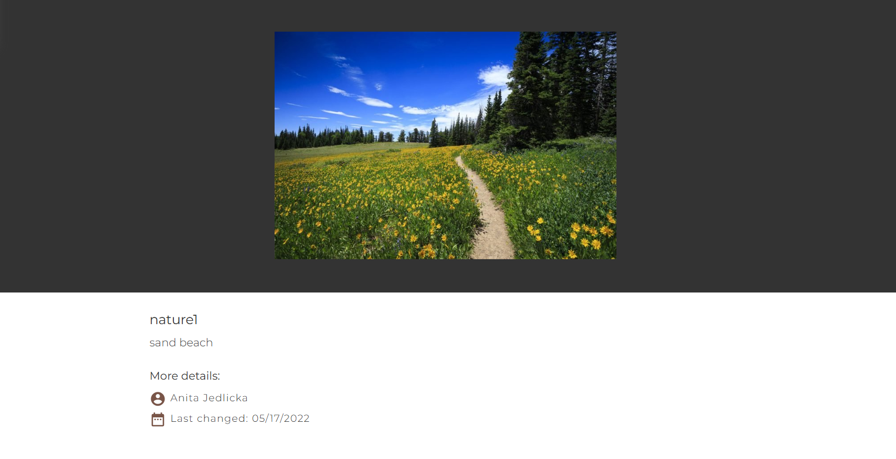 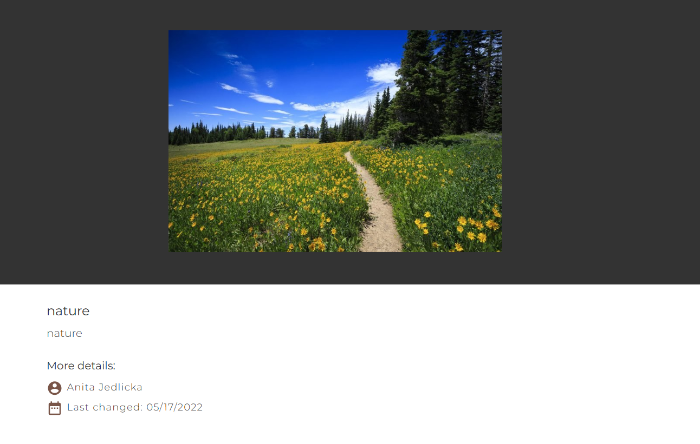 

